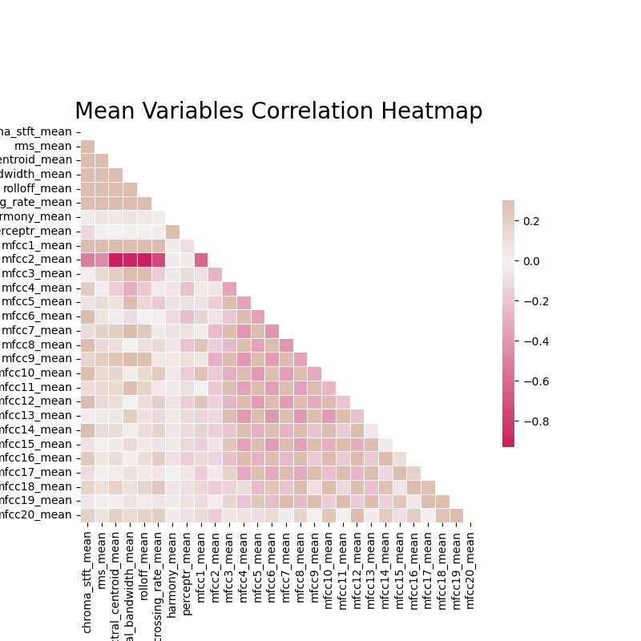

# Music Genre Classification in Python

## Overview
This project aims to classify audio clips of music into 10 different genres using machine learning. The model learns to recognize patterns in audio features (ex. tempo, spectral contrast, etc.) and predicts the genre of a given track. Two separate approaches are used:
1. A **tabular-based approach** with pre-extracted audio features
2. An **image-based** approach with mel-spectrograms processed by a **neural network**

## Approaches
1. **Tabular Approach**: Uses extracted features from the data alongside a neural network in order to classify genres.
2. **Image-Based Approach**: Generates mel-spectrograms from audiofiles, which are then used in a convolutional neural network for classification.
3. **Comparison**: Evaluates said approaches using accuracy, classification reports and confusion matrices.


## Technologies / Libraries Used
* **Python**: Programming Language
* **Librosa**: Extracting audio features, audio processing (ex. spectrograms)
* **scikit-learn**: For processing and model metrics
* **TensorFlow**: For neural network models
* **Matplotlib / Seaborn / Plotly**: For visualizations

## Goals
* Achieve a high classification accuracy for both approaches
* Comparing our two approaches to comprehend strengths and weaknesses
* Explore what other further learning can be done

## Dataset
The dataset is taken from the GTZAN Music Genre Dataset on Kaggle, which includes Blues, Classical, Country, Disco, Hip-Hop, Jazz, Metal, Pop, Reggae and Rock music data. The dataset includes the following:
* ```genres_original```, a folder with 1000 .wav files, 100 of each of the 10 genres (which are each 30 seconds long)
* ```images_original```, a folder with 1000 .png files (mel-spectrograms), 100 of each of the 10 genres that visually represent each audio file.
* 2 .csv files ```features_3_sec.csv``` and ```features_30_sec.csv```, which contain the numerical features of the audio files.

Note: The dataset can be found here: https://www.kaggle.com/datasets/andradaolteanu/gtzan-dataset-music-genre-classification

## Data Structure

```bash
music_genre_classification/
├── music_genre_classification.ipynb
├── data/
  ├── features_3_sec.csv
  ├── features_30_sec.csv
  ├── images_original/
    ├── rock/
    ├── reggae/
    ├── pop/
    ├── metal/
    ├── jazz/
    ├── hiphop/
    ├── disco/
    ├── country/
    ├── classical/
    └── blues/
  ├── genres_original/
    ├── rock/
    ├── reggae/
    ├── pop/
    ├── metal/
    ├── jazz/
    ├── hiphop/
    ├── disco/
    ├── country/
    ├── classical/
    └── blues/
```
## Data Preprocessing / Feature Engineering
Our .csv files have already been processed for the most part, so our only major changes and added features come in the form of the ```label``` column, which maps our musical genres onto a corresponding numerical value. We also remove features that will not be used, including the ```filename``` and ```length``` columns.

## Exploratory Data Analysis
In an attempt to identify any visible patterns or correlation between variables, we create a correlation matrix for the mean values of our variables from the columns of our .csv files.




